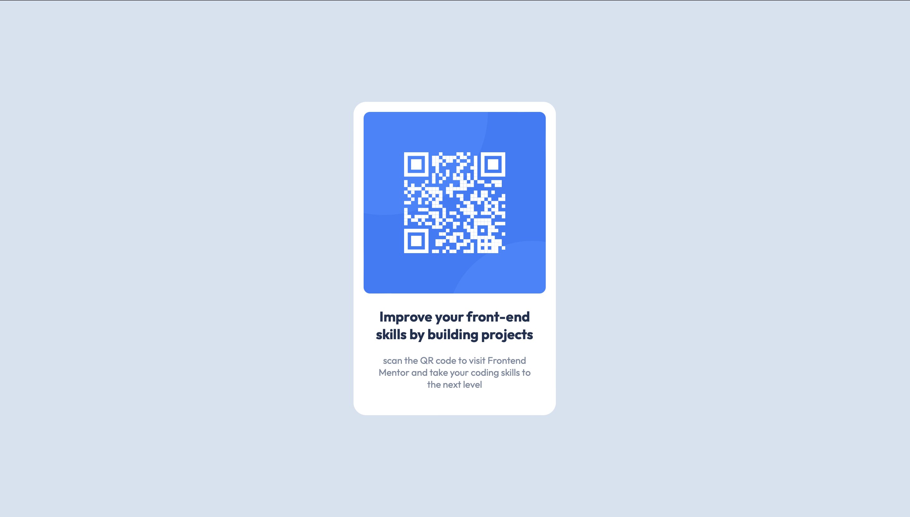

# Frontend Mentor - QR code component solution

This is a solution to the [QR code component challenge on Frontend Mentor](https://www.frontendmentor.io/challenges/qr-code-component-iux_sIO_H). Frontend Mentor challenges help you improve your coding skills by building realistic projects. 

## Table of contents

- [Overview](#overview)
  - [Screenshot](#screenshot)
  - [Links](#links)
- [My process](#my-process)
  - [Built with](#built-with)
  - [Useful resources](#useful-resources)
- [Author](#author)

## Overview

### Screenshot

### Links

- Solution URL: [Add solution URL here](https://github.com/Marco-Aldana/Practice-qr-code-component)
- Live Site URL: [Add live site URL here](https://marco-aldana.github.io/Practice-qr-code-component/)

## My process

### Built with

- Semantic HTML5 markup
- CSS custom properties
- Flexbox
- Mobile-first workflow
- Figma

### Useful resources

- [MDN Docs](https://developer.mozilla.org/es/) - The MDN Web Docs site provides information about Open Web technologies including HTML, CSS, and APIs for both Web sites and progressive web apps.
- [Fexbox Froggy](https://flexboxfroggy.com/) - A game to learn Flexbox.

## Author

- Website - [Marco Aldana](https://www.marco-aldana.com)
- Frontend Mentor - [@Marco-Aldana](https://www.frontendmentor.io/profile/Marco-Aldana)
- Twitter - [@MarcoAldana_Dev](https://twitter.com/MarcoAldana_Dev)

